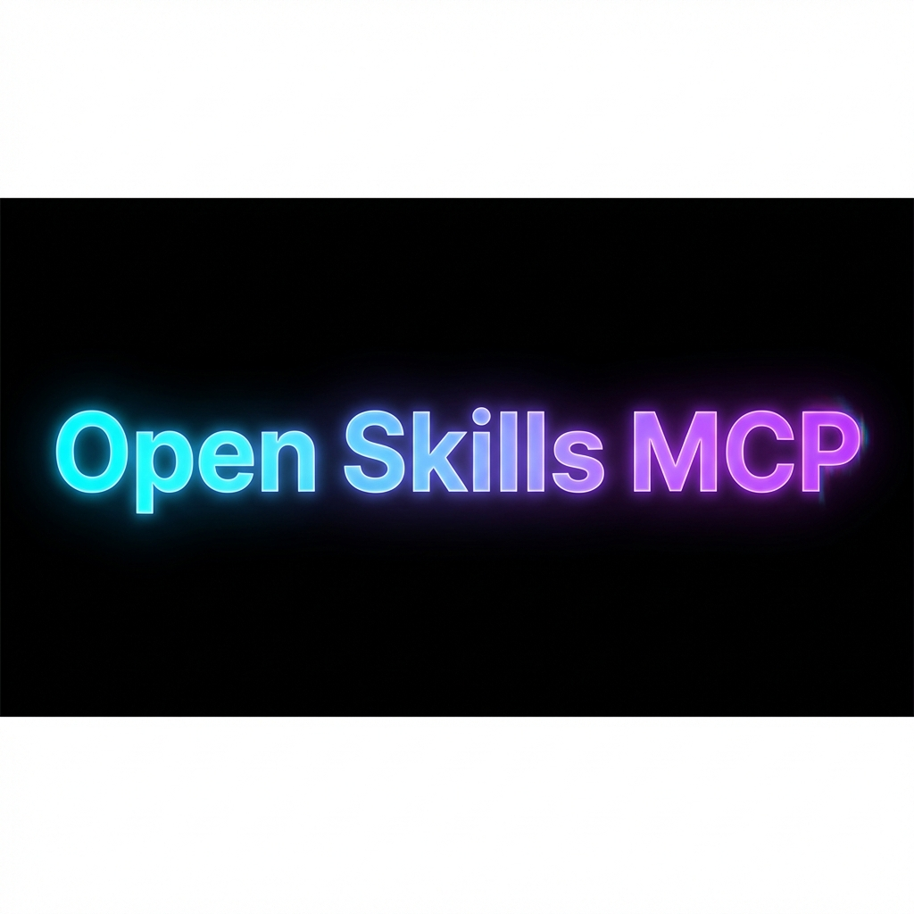

<div align="center">

# 

### Secure, Standardized, "Copy-Paste" Compatible Agent Skills Runtime

[](LICENSE)
[](https://www.python.org/)
[](https://modelcontextprotocol.io/)
[](https://www.docker.com/)

[English](README.md) | [简体中文](README_zh.md)

</div>

---

> **"Open Skills"** 是为了解决 Claude code 的 Skills 功能在各种差异化环境中可能出现的脚本运行失败等依赖地狱，以及直接在本机运行社区未知 Skill 代码带来的安全隐患。我将 Anthropic 强大的 Skills 协议完美复刻为即插即用的 MCP 模式，并将其封装在一个**安全、隔离、开箱即用**的 Docker 沙盒中，让你在任何支持 MCP 的 AI 应用中都能畅享 Skills 的强大。

## 🚀 核心使命 (Mission)

Open Skills 是一个基于 [Model Context Protocol (MCP)](https://modelcontextprotocol.io/) 的通用技能运行时。它旨在让任何支持 MCP 的 AI 应用（如 Google Antigravity, Cursor, Windsurf）能够快速接入火爆的 Skills 能力，并安全地执行复杂任务，同时解决两大痛点：

1. **依赖地狱**: 不再需要为每个脚本配置复杂的 Python 环境，或者 agent 因为运行失败给你的本机安装大量不明依赖包，沙盒里预装了必要依赖并给予 agent 临时安装依赖包的权限，净化你的本机环境。

2. **安全隐患**: 彻底杜绝 AI 修改系统文件或执行恶意代码的风险，沙盒环境挂载你的 `/skills` （只读）目录和工作区 `/share` （读写）目录，恶意代码运行在沙箱环境中，无法修改和读取本机工作区之外的重要文件。

## ✨ 核心特性 (Features)

| 特性 | 说明 |
| :--- | :--- |
| **📦 开箱即用 (Out of the Box)** | **Copy-Paste 兼容性**。直接复制 [anthropics/skills](https://github.com/anthropics/skills) 的文件夹或者社区 Skill ，无需修改一行代码即可运行。智能适配层会自动处理路径映射。 |
| **🛡️ 沙盒隔离 (Sandbox Security)** | 所有代码均运行在用后即焚的**Docker 容器**中。Agent 只能访问挂载到本机的 `/skills` 和 `/share` 目录，宿主机系统绝对安全。 |
| **🔋 全能环境 (Batteries Included)** | 预装 Python, Node , Pandas, Numpy, LibreOffice 等主流依赖。告别 `pip install` 的烦恼，专注于任务本身。 |

## 🔐 安全与架构设计 (Architecture & Design)

Open Skills 在安全性与易用性之间做了精心的平衡设计：

### 1. Agent 权限模型 (The Agent Model)

Agent 在容器内以 **`agent` (uid=1000)** 用户身份运行，而非 Root。

* **权限边界**: 剥夺了破坏系统（如 `apt-get`, `rm -rf /bin`）的能力，但保留了所有创造性工作（代码读写、脚本执行、`pip/npm install`）的权限。
* **文件所有权**: `agent` 用户通过 Docker 挂载机制拥有 `/share` 工作区的完全读写权，确保 Agent 生成的文件在宿主机上也是普通用户权限，不会出现 "root user only" 的文件锁死问题。

### 2. 智能 Node.js 环境 (Smart Node Setup)

为了解决 "Agent 想装包但没权限" 的经典死锁，我们采用了 **Environment Injection** 设计：

* **无感知安装**: 配置 `NPM_CONFIG_PREFIX="/share/.npm-global"`，当 Agent 执行 `npm install package` 时，包会被自动安装到它有写权限的 `/share` 下。Agent 以为它在装全局包，实际上它在装用户包——**Zero Config, Zero Error**。

## 📂 目录与架构

```text
open-skills/
├── open_skills/               # [Core] 核心逻辑包
│   ├── cli.py                 # MCP Server 入口
│   ├── sandbox.py             # Docker 容器管理器
│   ├── Dockerfile             # 全能镜像定义
│   └── skills/                # 技能库 (在这里放入你的 Skills)
├── docs/                      # [Docs] 文档与指南
│   ├── EN/                    # 英文文档
│   └── ZH/                    # 中文文档
├── README.md                  # 英文文档
├── README_zh.md               # 中文文档
└── LICENSE                    # MIT 开源协议
```

## 🛠️ 工具集 (Toolbox)

连接 Open Skills MCP 服务后，您的 Agent 将获得以下超能力：

* 📚 **`manage_skills`**: **技能向导**。列出并查看可用技能的详细文档（自动注入沙盒路径）。
* 💻 **`execute_command`**: **执行引擎**。在安全容器内运行 Bash 命令（Python, Node, Shell 等）。
* 📂 **`read_file` / `write_file`**: **文件操作**。在工作区 (`cwd`) 安全地读写文件。
* ☁️ **`upload_to_s3` / `download_from_s3`**: **云端传输**。配置 .env 后即可实现 agent 自动执行文件与 S3 的互传。
* 👀 **`list_directory`**: **环境感知**。在工作区安全地列出目录内容，非 IDE 环境需要。

## 💡 最佳实践

### 让 Agent 适应沙盒环境

由于彻底摘离了 Skills 的系统级运行环境并重新设计了沙盒运行机制，我建议在你的 Agent Prompt 中加入一段 **Prompt 秘籍** ，帮助它更好的掌握 skills 和沙盒环境。（可选，感觉 MCP 服务效果不佳时启用）

 [Agent 指南（MD）](docs/ZH/AGENT_PROMPT.md) > 将这段提示词插入你原本的 System Prompt 中。

**这能解决：**

1. **空间感知**: 明确 `/share` 对应当前目录。
2. **标准流程**: 强制执行 "查文档 -> 写代码 -> 跑测试" 的 SOP。
3. **权限自信**: 赋予 Agent 敢于在沙盒内执行命令的信心。

### ⚠️ 关于"元技能" (Meta-Skills)

**请在沙盒环境测试后再进行转移** `skill-creator` 等让 AI 自己写技能的工具生成的 Skill 需要你手动从工作区转移至 `/skills` 目录。

* **风险**: AI生成的脚本具有不确定性，直接在本机运行可能会产生风险。
* **建议**: **人工审查代码，AI 执行操作**。

## ⚡ 快速开始 (Quick Start)

### 1. 准备工作 (Prerequisites)

本项目核心运行在安全隔离的 Docker 沙盒中，因此是**必选**步骤：

1. 安装 [Docker Desktop](https://www.docker.com/products/docker-desktop/) 并启动。
2. 准备镜像（**二选一**）：

    * **选项 A：直接拉取 (推荐)**

        ```powershell
        docker pull forever17/open-skills:latest
        ```

    * **选项 B：手动构建 (开发者)**

        手动修改 Dockerfile ，预装你最常用的依赖包，然后重新构建镜像。

        ```powershell
        # 在源码目录下执行
        docker build -t open-skills:latest open_skills/
        ```

### 2. 配置 (Configuration)

我们**强烈推荐**使用 `uvx` (无需手动安装 Python 环境) 直接运行。

#### 🚀 推荐配置 (via uvx)

在您的 `mcp_config.json` (VS Code) 或任意支持 MCP 协议的AI工具中添加：

```json
{
  "mcpServers": {
    "open-skills": {
      "command": "uvx",
      "args": [
        "--from", "open-skills-mcp", "open-skills",
        "--skills-dir", "E:\\Your_Projects\\skills",  // [必选] 挂载本地 Skills 目录
        "--work-dir", "E:\\Your_Projects\\workspace"      // [必选] 指定工作区目录
      ],
      "env": {
        // [可选] 如果需要 S3 功能
        "S3_BUCKET": "your_bucket",
        "S3_REGION": "default",
        "S3_ENDPOINT": "https://***.com",
        "S3_CUSTOM_DOMAIN": "https://***.com",
        "S3_ACCESS_KEY": "your_key",
        "S3_SECRET_KEY": "your_secret"
      }
    }
  }
}
```

> **注意**:
> 必须配置这两个参数："--skills-dir" 挂载本地 Skills 目录**必选**，"--work-dir" 手动指定你的工作区目录**必选**。

---

<details>
<summary><strong>🔧 开发安装 (Development Installation)</strong></summary>

如果您是开发者，希望通过源码运行或调试：

### 运行模式 (Running Modes)

#### 模式 A: SSE (推荐用于开发调试)

启动 HTTP 服务：

```bash
uvicorn open_skills.cli:mcp.sse_app --port 8000
```

SSE 客户端配置：

```json
{
  "mcpServers": {
    "open-skills": {
      "serverUrl": "http://localhost:8000/sse"
    }
  }
}
```

#### 模式 B: Stdio (本地源码运行)

如果不使用 `uvx`，而是直接运行源码：

##### 安装 (Install)

```powershell
git clone https://github.com/justForever17/open-skills.git
cd open-skills
pip install -e .
```

**Windows**:

```json
{
  "mcpServers": {
    "open-skills": {
      "command": "python",
      "args": ["-m", "open_skills.cli"],
      "cwd": "E:\\Projects\\open-skills" // 源码目录
    }
  }
}
```

**macOS / Linux**:

```json
{
  "mcpServers": {
    "open-skills": {
      "command": "python3",
      "args": ["-m", "open_skills.cli"],
      "cwd": "/path/to/open-skills"
    }
  }
}
```

</details>

---

<div align="center">
Made with ❤️ for the Agentic Future
</div>

## 📄 开源协议 (License)

本项目基于 [MIT License](LICENSE) 开源。
